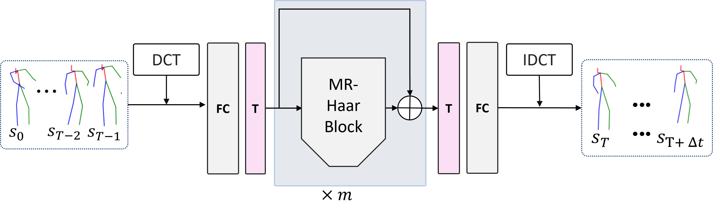
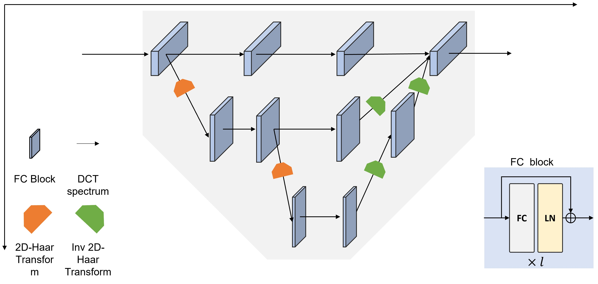

# Multi-Resolution Haar Network: Enhancing human motion prediction via Haar transform


The 3D human pose is vital for modern computer vision and computer graphics, and its prediction has drawn attention in recent years. 3D human pose prediction aims at forecasting a human's future motion from the previous sequence. Ignoring that the arbitrariness of human motion sequences has a firm origin in transition in both temporal and spatial axes limits the performance of state-of-the-art methods, leading them to struggle with making precise predictions on complex cases, e.g., arbitrarily posing or greeting. To alleviate this problem, a network called HaarMoDic is proposed in this paper, which utilizes the 2D Haar transform to project joints to higher resolution coordinates where the network can access spatial and temporal information simultaneously. An ablation study proves that the significant contributing module within the HaarModic Network is the Multi-Resolution Haar (MR-Haar) block. Instead of mining in one of two axes or extracting separately, the MR-Haar block projects whole motion sequences to a mixed-up coordinate in higher resolution with 2D Haar Transform, allowing the network to give scope to information from both axes in different resolutions. With the MR-Haar block, the HaarMoDic network can make predictions referring to a broader range of information. Experimental results demonstrate that HaarMoDic surpasses state-of-the-art methods in every testing interval on the Human3.6M dataset in the Mean Per Joint Position Error (MPJPE) metric.
### Network Architecture
------


**An overview of the architecture of HaarMoDic.**

 **FC** denotes for full-connected layer, and **T** denotes for transpose operation. **DCT** and **IDCT** denote discrete cosine transform and the inverse operation. The detailed explanation of the **MR-Haar Block** is in section MR-Haar_block in the paper. To get better performances, $m$ MR-Haar blocks are concatenated in the network.
### Inner structure of MR-Haar Block
------


**Illustration of MR-Haar Block.** 

This figure illustrates one kind of MR-Haar block containing three orders of Haar transform, and the number of the full-connected layers for each order are 4, 2, 1. **FC** denotes the full-connected layer, and **LN** denotes for layer normalization. All the spectrums in different orders are merged together at the second from the last stage. The residual pathway is not included.
### Requirements

#### Install Pytorch_wavelet

Please follow the instruction of [pytorch_wavelets](https://github.com/fbcotter/pytorch_wavelets) to make sure you install pytorch_wavelet in your environment properly.

#### other requirements
------
- PyTorch >= 1.5
- Numpy
- CUDA >= 10.1
- Easydict
- pickle
- einops
- scipy
- six

### Data Preparation
------
All the data are prepared in the `./data` directory.
Unzip the `./data/h36m.zip` to the `./data` folder and create a directory structure which contains these files:
```shell script
data
|-- h36m_test.txt
|-- h36m_train.txt
|-- h36m
|   |-- S1
|   |-- S5
|   |-- S6
|   |-- ...
|   |-- S11
```


### Training
```bash
cd exps/baseline_h36m/
sh run.sh
```


## Evaluation

```bash
cd exps/baseline_h36m/
python test.py --model-pth your/model/path
```

