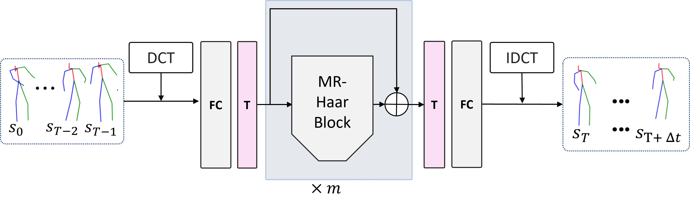

# HaarMoDic
**HaarMoDic: Enhancing human motion prediction
via Haar transform** 

In this paper, we propose a naive MLP-based network for human motion prediction. The network consists of only FCs, LayerNorms and Transpose operation. There is no non-linear activation in our network.

[paper link](https://arxiv.org/abs/2207.01567)

### Network Architecture
------


### Inner structure of MR-Haar Block
------


### Requirements

#### Install Pytorch_wavelet

Please follow the instruction of [pytorch_wavelets](https://github.com/fbcotter/pytorch_wavelets) to make sure you install pytorch_wavelet in your environment properly.

#### other requirements
------
- PyTorch >= 1.5
- Numpy
- CUDA >= 10.1
- Easydict
- pickle
- einops
- scipy
- six

### Data Preparation
------
Download all the data and put them in the `./data` directory.

[H3.6M](https://drive.google.com/file/d/15OAOUrva1S-C_BV8UgPORcwmWG2ul4Rk/view?usp=share_link)

[Original stanford link](http://www.cs.stanford.edu/people/ashesh/h3.6m.zip) has crashed, this link is a backup.

Directory structure:
```shell script
data
|-- h36m
|   |-- S1
|   |-- S5
|   |-- S6
|   |-- ...
|   |-- S11
```


### Training
```bash
cd exps/baseline_h36m/
sh run.sh
```


## Evaluation

```bash
cd exps/baseline_h36m/
python test.py --model-pth your/model/path
```

